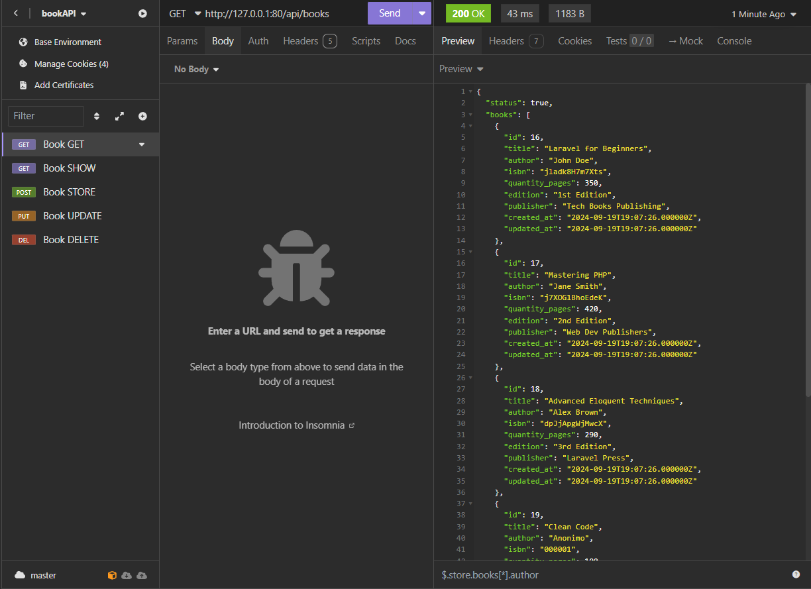
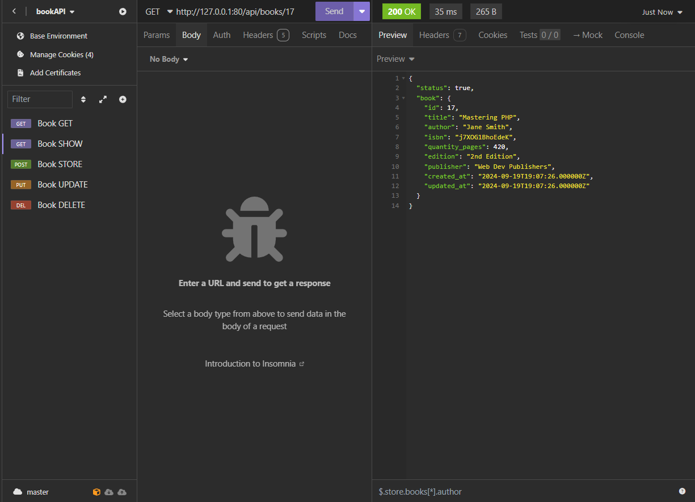
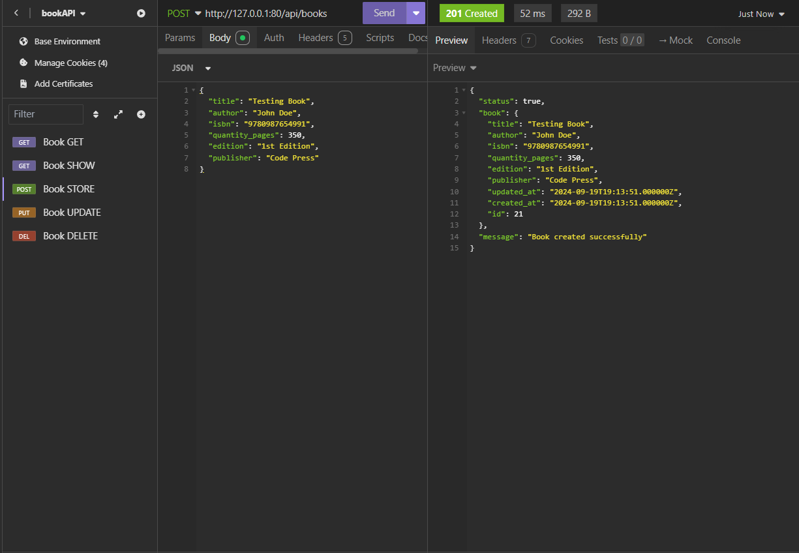
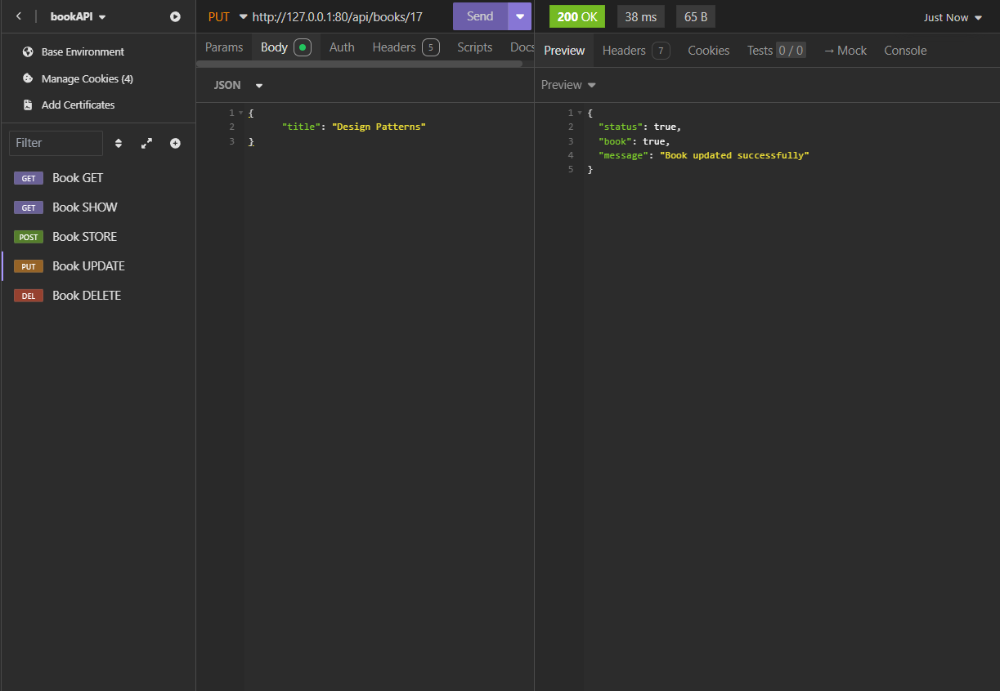
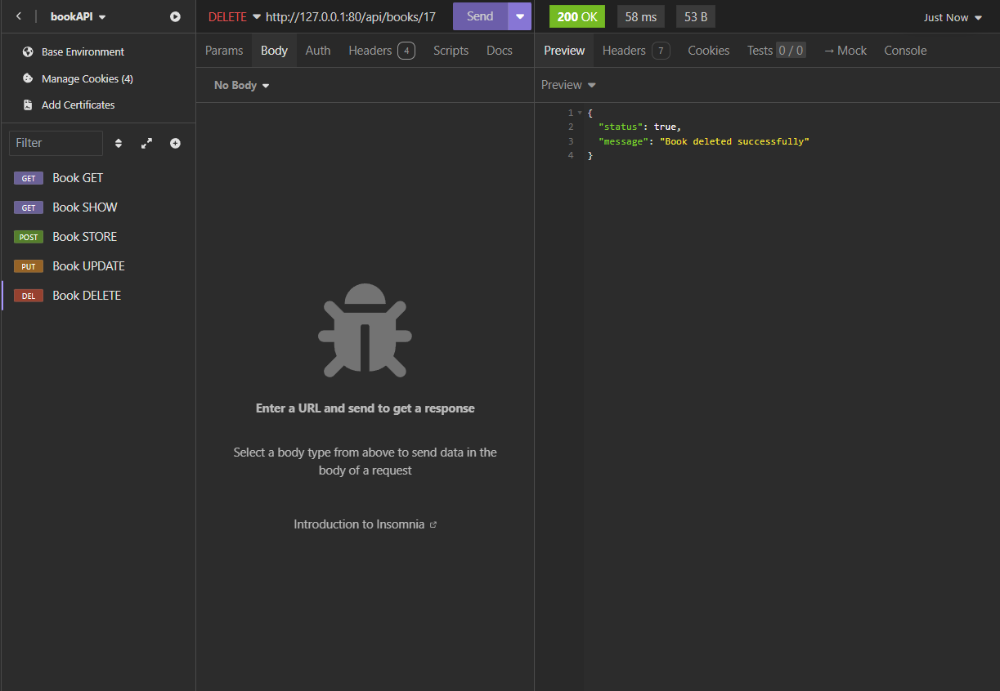
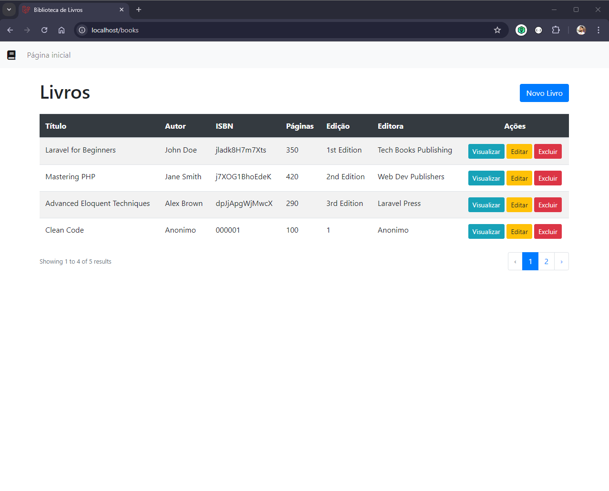
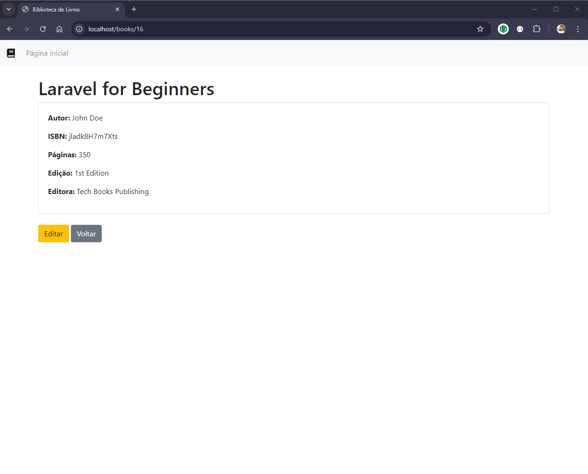
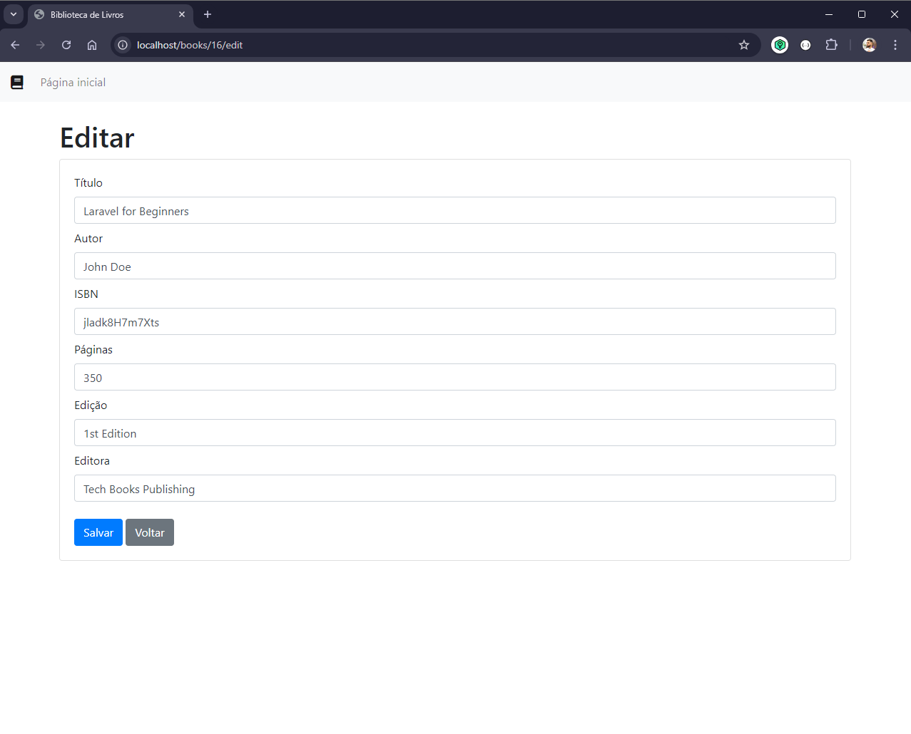
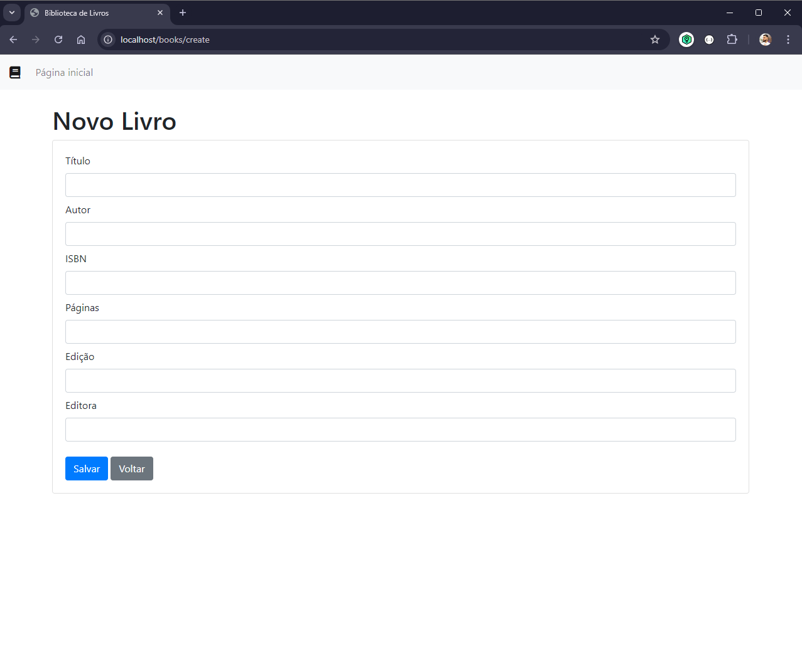

# Books Library

## Descrição PT-BR

Esta é uma aplicação simples de biblioteca de livros que permite aos usuários adicionar, editar e excluir livros de uma lista. Devido a limitações de tempo, não foi possível implementar os padrões de service, repository e repository interface em todos os métodos. No entanto, apliquei-os no método `store` do controlador `bookController` para demonstrar meu conhecimento sobre esses conceitos.

## Description EN

This is a simple book library application that allows users to add, edit, and delete books from a list. Due to time constraints, it was not possible to implement the service, repository, and repository interface patterns in all methods. However, I applied them in the `store` method of the `BookController` to demonstrate my knowledge of these concepts.

## Technologies

* Laravel 11
* PHP 8.2
* MySQL 8.0
* Docker
* Composer
* Bootstrap CSS

## Features

* List all books from the list
* View a single book from the list
* Add books to the list
* Edit books from the list
* Delete books from the list

## Installation

1. Clone the repository
2. Access the project directory
3. Suba do container
   ```
    docker-compose up
   ```

## Usage API

1. Use INSOMNIA or POSTMAN to test the API
2. Use the following endpoints:
    - GET /books
    - GET /books/<id>
    - POST /books
    - PUT /books/<id>
    - DELETE /books/<id>
3. Use the following JSON format for POST and PUT requests:

```json
    {
        "title": "Mastering PHP",
        "author": "John Doe",
        "isbn": "9780987654343",
        "quantity_pages": 200,
        "edition": "1st Edition",
        "publisher": "Code Press"
    }
```

4. The API will return a JSON object with the book information.

## Usage WEB

1. Access the web interface at http://localhost:80/books
2. Use the web interface to add, edit, and delete books from the list.

## Images API







## Images WEB





